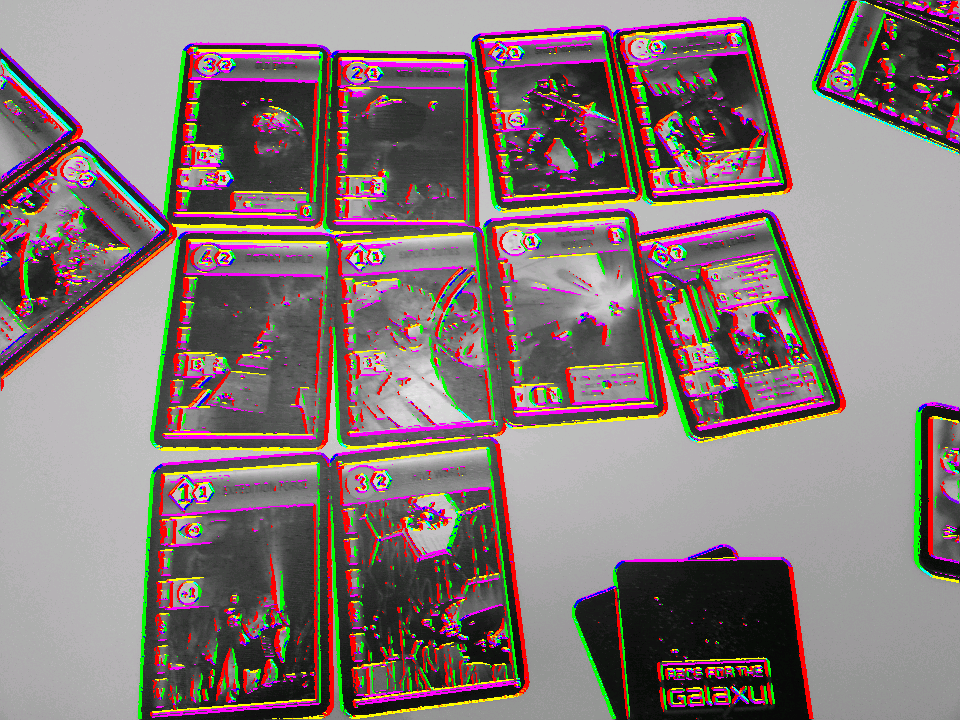
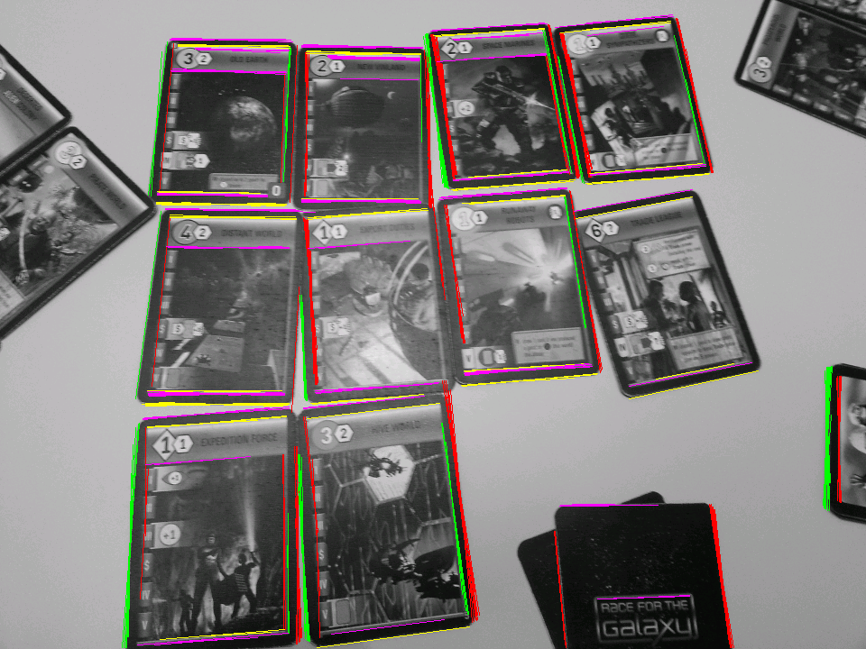
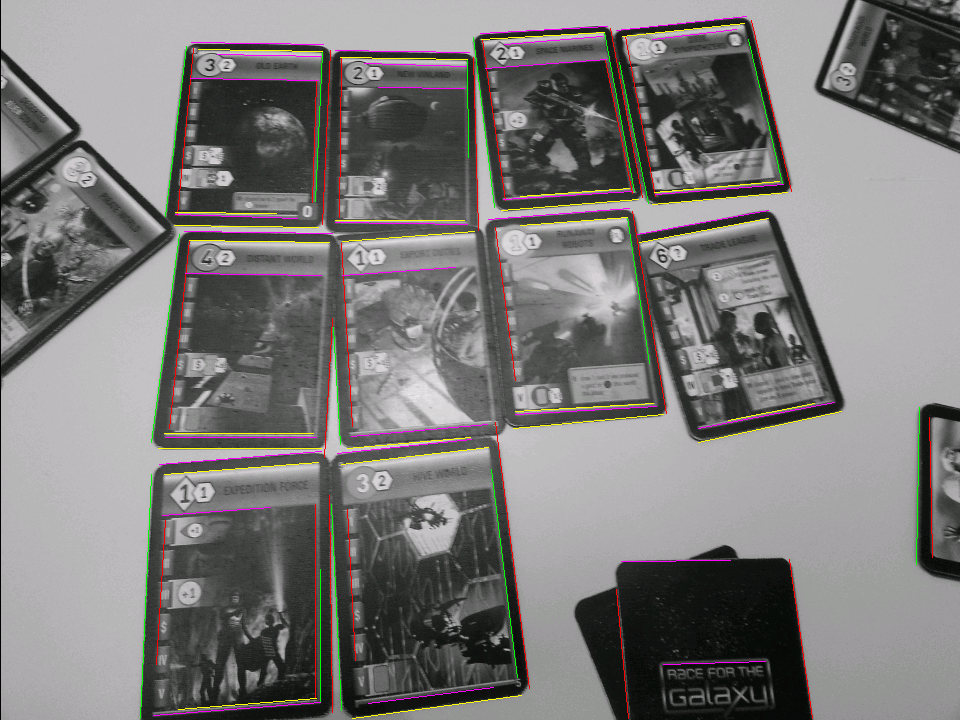
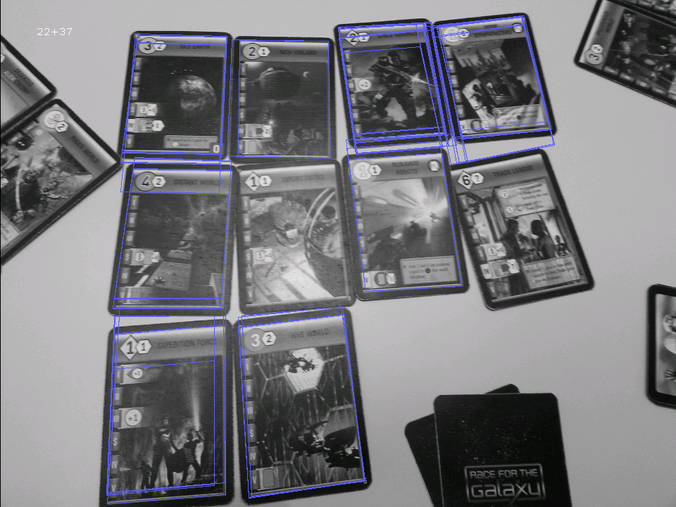
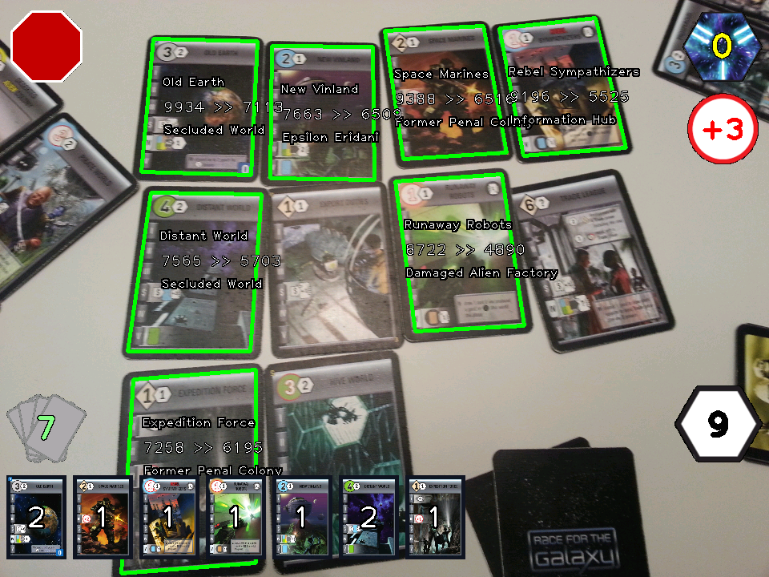
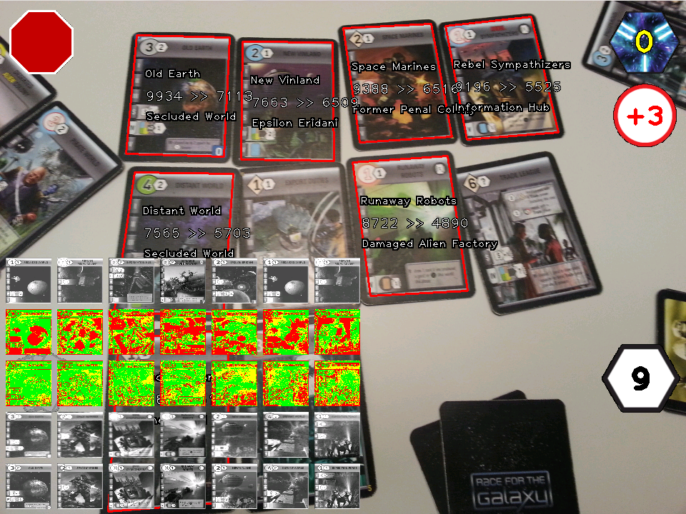

Алгоритм локализации и распознавания карт Race for the Galaxy
=============================================================

Общие устройство
----------------

Алгоритм распознавания работает с каждым полученным кадром по-отдельности, не используя промежуточные данные распознавания из предыдущих кадры.
Только после того как все карты с картинки распознаны, набор распознанных карт добавляется к картам распознанным с предыдущих кадров.

Для ускорения и упрощения написания алгоритма распознавания сделано предположение, что все искомые карты находятся в более-менее вертикальном положении.
Кроме того, оказалось что эта особенность очень удобна для пользователя, так как она гарантирует что катры соседа не будут случайно распознаны,
даже если они попадут в поле зрения камеры, что в реальной жизни практически неизбежно.

Принципиально, алгоритм делится на две большие части, каждая из которых содержит по несколько шагов.

* Найти потенциальные места расположения карт на картинке.
    * Применение оператора Собеля для нахождения точек лежащих на границах линий.
    * Применение преобразования Хафа для нахождения всех отрезков из которых могут состоять границы карт.
    * Объединение групп отрезков (удаление почти одинаковых отрезков).
    * Формирование потенциальных мест расположения рамок из имеющихся отрезков.
* Для всех потенциальных мест расположения карт выполнить сравнение с образцами.
    * Перспективное преобразование предполагаемых изображений карт и нормализация их яркости/контраста.
    * Сравнение с шаблонными изображениями и выявление совпадений.
    * Удаление накладывающихся и повторяющихся совпадений.

Нахождение потенциальных мест расположения карт
-----------------------------------------------

Для поиска карты в кадре используется тот факт, что все карты имеют одинаковую чёрную рамку достаточно большой толщины.
В зависимости от заднего фона на котором лежит карта, эффективно искать либо внутренний, либо внешний край этой рамки.
Например, если карта лежит на тёмной поверхности, то внешняя кромка будет практически не видна, однако при этом
относительная яркость рисунка карты будет велика (это результат автоматической подстройки камеры телефона) и поэтому внутренняя
кромка чёрной рамки будет отчётливо видна.
Если же карта лежит на яркой поверхности, тогда внешняя кромка карты будет видна очень чётко, в то время как внутренняя,
возможно, будет теряться вследствие того что яркость рисунка карты будет низкой.

### Нахождение граничных точек

Для нахождение точек принадлежащих к границам рамок используется свёртка с ядром оператора собеля 3x3, т.е. фактически оценивается
значение производной яркости изображения по двум направлениям.
В отличие от классического использования оператора собеля, диагональные направления производной не рассматриваются, зато отдельно
обрабатываются случаи положительной и отрицательной производной, позволяя таким образом выяснить не только место положения границы,
но и то какая именно это граница (левая/правая/верхняя/нижняя).

На картинке показан результат применения оператора Собеля. Цвет показывает к какой стороне чёрного прямоугольника принадлежит точка:

* зелёный - левая
* красный - правая
* пурпурный - верхняя
* жёлтый - нижняя
* синий - левая и верхняя
* голубой - левая и нижняя
* фиолетовый - правая и верхняя
* оранжевый - правая и нижняя

### Получение отрезков границ

Для объединения граничных точек в отрезки используется преобразование Хафа, т.е. для каждой точки принадлежащей границе ищутся все линии в которых эта точка может состоять.
Классический вариант преобразования Хафа выделяет только линии (не отрезки) и использует для описания линий полярные координаты,
которые дают сложноустранимую неоднородность точности определения линии в зависимости от её расстояния до начала координат.
Поскольку в данном случае важны только почти вертикальные или почти горизонтальные отрезки, можно воспользоватся более простой для расчётов формулой линии вида __y__ = __a__ * __x__ + __b__,
где коэффициент __a__ принимает значения в диапазоне от -0.25 до 0.25 что примерно соответвует максимально допустимому отклонению в 15 градусов.
Такое упрощение легко позволяет полностью отказаться от арифметики с плавающей запятой, а также, что ещё более важно, выделять отрезки (а не просто линии) непосредственно в процессе преобразования.
При этом контроллируется чтобы отрезки были не меньше определённой длинны и не имели слишком больших разрывов.
Левые, правые, верхние и нижние точки обрабатываются независимо и параллельно, при этом для верхних и нижних точек изображение предварительно транспонируется.

### Объединение групп близколежащих отрезков

Из-за того что границы карт обычно довольно размыты, выделение отрезков даёт большое кол-во параллельных или почти параллельных близколежащих отрезков.
Объединение их в один усреднённый отрезок происходит в два этапа. Сначала объединяются все абсолютно параллельные отрезки, т.е. те у которых коэффициент __a__ одинаков. Для проверки их
близости достаточно проверить близость коэффициентов __b__ и, конечно, проверить что по начальным и конечным координатам __y__ они хотя бы пересекаются.

В результате получаются пучки отрзков:

Далее угол наклона по группе близколежащих отрезков усредняется и получаются окончательные границы:

### Формирование прямоугольников из имеющихся граничных отрезков

Имея левые, правые, верхние и нижние границы можно составить более-менее прямоугольные четырёхугольники соответствующие границам карт.
При этом контроллируется чтобы получившийся прямоугольник не был слишком маленьким, его противоположные стороны были приблизительно параллельны,
соотношение высоты к ширине примерно равнялось 5 к 7 (формат карты).

Сначала проводится поиск внутренних кромок рамок, если результат даёт недостаточно много вариантов (сейчас меньше 100), проводится
дополнительно поиск внешних рамок. Для поиска внешних рамок используется тот же алгоритм что и для внутренних, только левые границы меняются местами с правыми, а верхние с нижними.
Полученные результаты по поиску внешних кромок легко транслируются с результаты поиска внутренних кромок, так как ширина чёрной рамки относительно всей карты известна.

На картинке показаны все выделенные прямоугольники. 22 выделено по внутренней кромке, 37 по внешней.

Сравнение с образцами
---------------------

### Подготовка выделенного прямоугольника к сравнению с образцами

Для каждого найденного прямоугольника выполняется перспективное преобразование приводящее его к размеру пригодному для сравнения (сейчас 64x64).
Сейчас эта операция выполняется средствами библиотеки OpenCV с использованием линейной интерполяции.

Нормализация контраста/яркости проводится по каждому каналу отдельно. Для нормализации используется линейное преобразование яркостей подобранное так,
чтобы привести среднее значение и среднее квадратичное отклонение яркости к фиксированным значениям (127.5 и 70).

### Сравнение с образцами

При сравнении выборки с каждым шаблоном считается степень их схожести.
Степень схожести считается как сумма очков схожести по каждму пикселу изображения.
В цветном варианте считается сумма абсолютных разностей по всем трём каналам. Далее за разность менее 40 даётся 3 очка, за разность менее 80 - 2 очка.
В чёрно-белом варианте за абсолютную разность яркостей меньше 15 даётся 3 очка, меньше 30 - 2 очка.
Таким образом максимальное кол-во очков равно 12288.

После сравнения со всеми образцами выявляются два наиболее подходящих образца и проверяется что:

1. Самый подходящий набрал больше 5000 очков.
2. Следующий подходящий отстаёт не менее чем на 1000 очков.

### Выбор распознанных карт

В результате сравнений с образцами получается некоторое кол-во пересекающихся карт которые успешно прошли проверку. Обычно это одна и та же
карта распознанная по нескольку раз с нескольких слабо отличающихся друг от друга прямоугольников.
Для отсечения подобных случаев происходит сортировка всех совпадений по убыванию их очков и дальше в качестве окончательно распознанных карт
берутся только те которые не пересекаются с другими, набравшими большее кол-во очков.

На рисунке показан результат распознавания с баллами и названием первой и второй схожей карты

На рисунке для каждой распознаной карты показано как выглядит с точки зрения распознавателя выделенный прямоугольник (самый нижний ряд), первая и вторая схожие карты,
а также результаты их попиксельного сравнения. Зелёный цвет - совпадение на 3 очка, жёлтый - на два, красный - совпадения нет.

