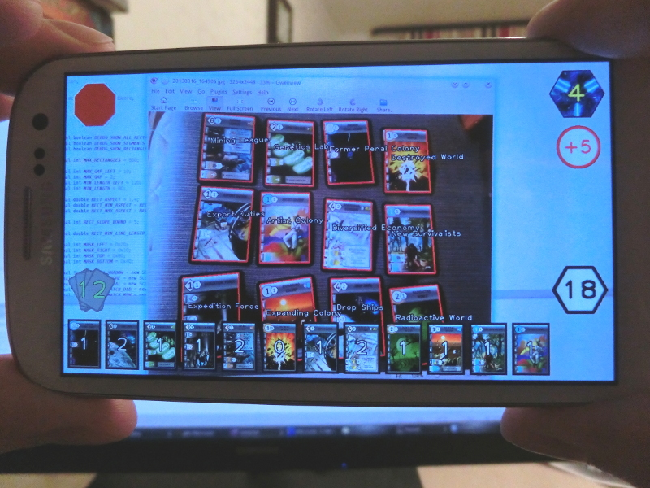

RftG-Scorer
===========

Race For The Galaxy board game scorer for Android with recognition ability.

[Download for Android](https://github.com/grchld/rftg-scorer/blob/release/RftG-Scorer.apk?raw=true)

About
-----

This is a little homebrew application for Android based phones which goal is to help Race For The Galaxy game players to calculate their total victory points fast. The main idea is to make your phone to recognize cards you have played and show you the total score and other statistics.

This project is open-source and non-profitable, however it contains art which belongs to [Rio Grande Games](http://www.riograndegames.com) and Race For The Galaxy designer Tom Lehmann. Also, it contains parts of another really cool open project http://keldon.net/rftg/

For now, only the first expansion pack (The Gathering Storm) is supported, but I think this can be easily changed in future.

As far as card matcher uses the whole image of a card, it can work for localized card sets well too. I've checked it on Russian and French card sets.

Requirements
------------

Android device with rear camera, HD-resolution screen, >1Ghz ARM CPU with NEON support and two or more cores :)

I can run it on my Samsung Galaxy S3 and have absolutely no clue if it works on any other devices, however I hope it does.

Upd: I also try it out on Samsung Galaxy W I8150 with 480x800 screen and single core CPU and it is still usable.

Installation
------------

This application uses OpenCV library, so OpenCV Manager must be installed from Play Market or, alternatively, downloaded and installed from [this](http://opencv.org/) site.

RftG-Scorer apk is [here](https://github.com/grchld/rftg-scorer/blob/release/RftG-Scorer.apk?raw=true).

Usage
-----

Take your phone horizontally so that red reset button is on the left and blue chips-increment button is on the right.
Point it to the cards placed on the table. Try not to be too close, normally it should be able to recognize 8 card laying in 2 rows from the single frame.
Newly recognized cards are outlined with green, others are outlined with red.

Card can be recognized only when it is in more or less upward position. Rotated card will not be recognized.

Add chips by pressing the chips button.

Press red reset button to clear recognized cards list and to reset chips counter.

Don't leave recognizer in a working state when it is not needed or your battery will drain fast. It should be just enough to lock the phone with the power button to pause recognition loop.

Known issues
------------

* False positives, although this case seems to be rare, this could still be a great problem, because it is hard to be noticed by user. Check the total amount of recognized cards.

* Make it works faster. I've already do some ARM-NEON-specific optimization, but further optimization is definitely possible.

* Application is loading slow (up to 5 sec). This is because of scaling original pictures to formats appropriate for matching and drawing. It's just easier to debug recognition engine and to draw interface in that way.

* Add support for the second and third expansion packs, goal statuses, prestige.

* Redraw/redesign this ugly interface.

